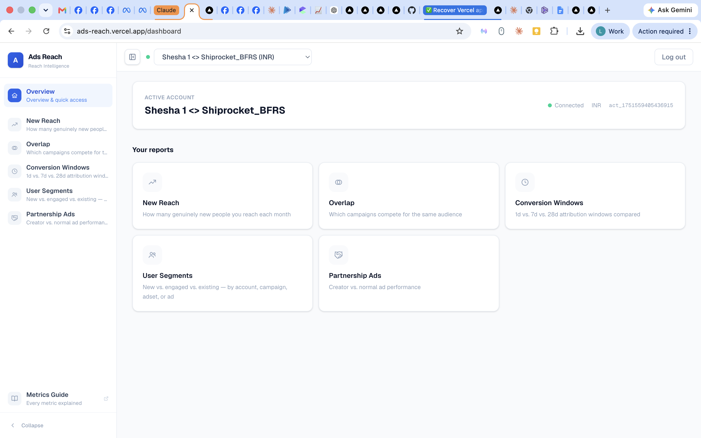
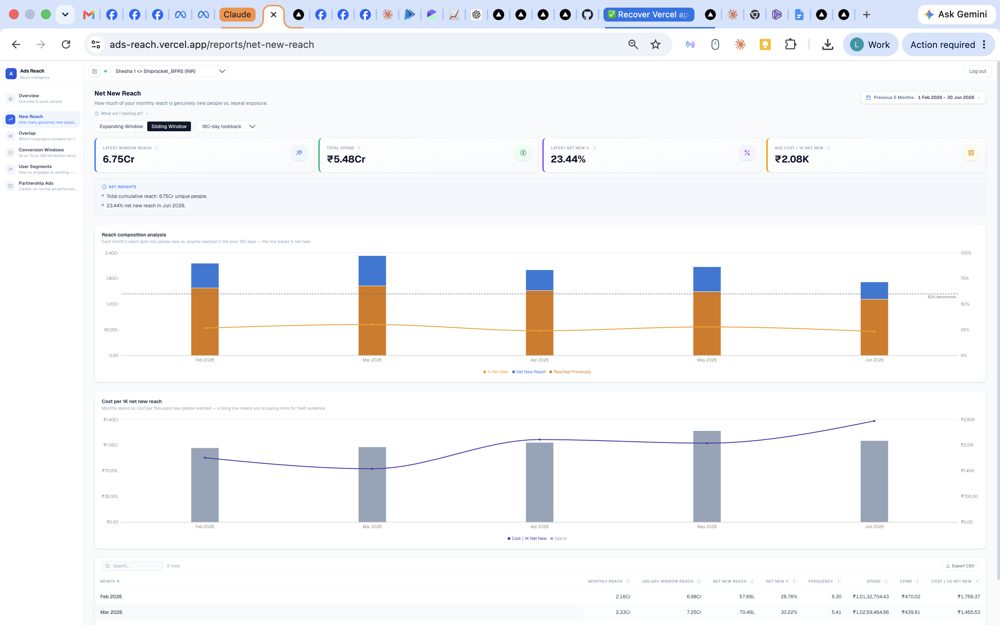
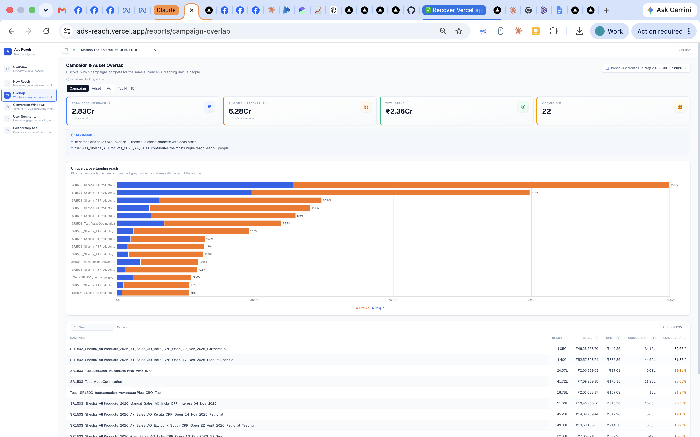
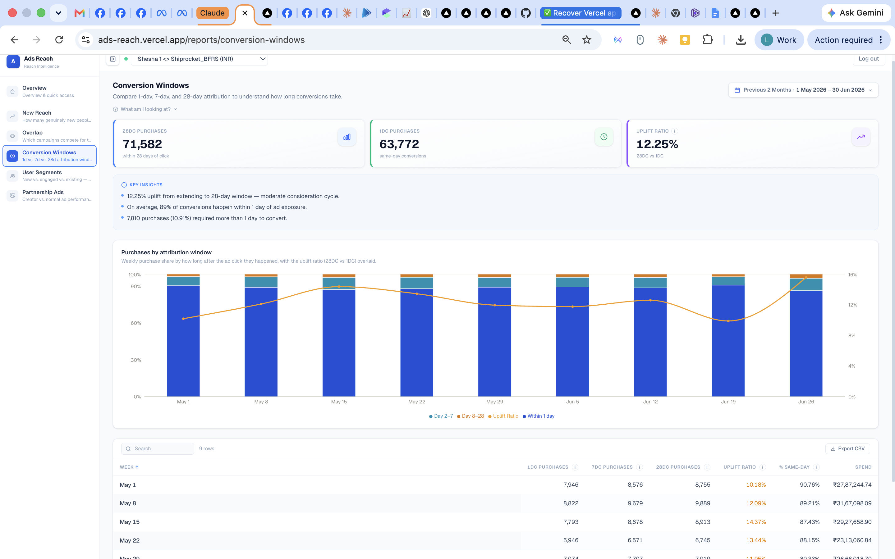
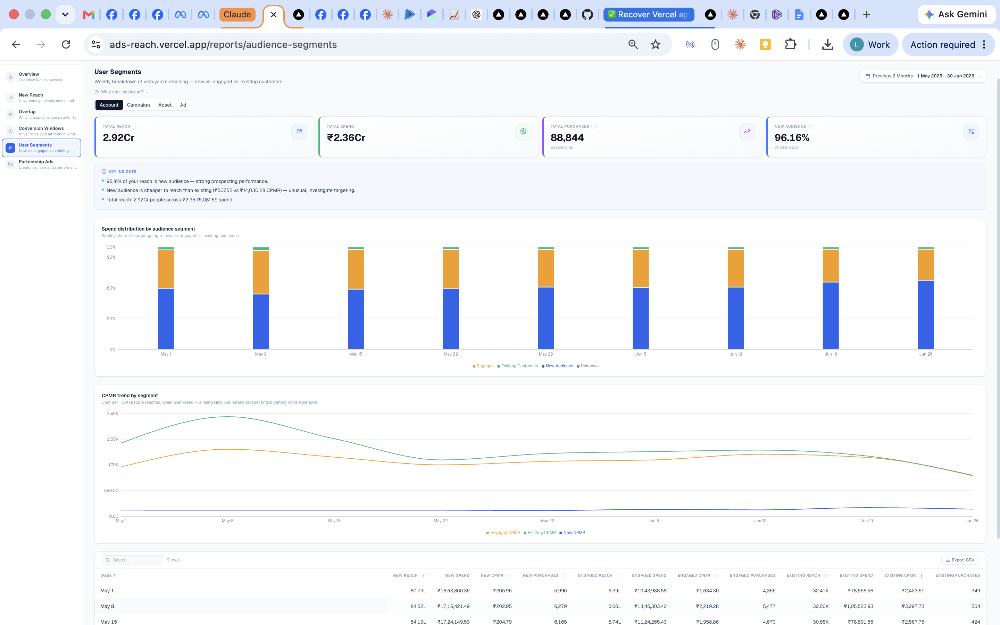
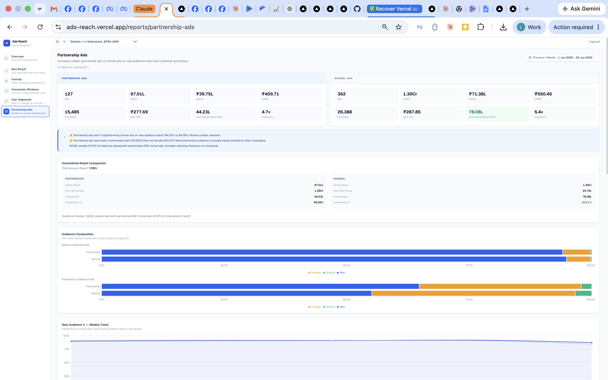
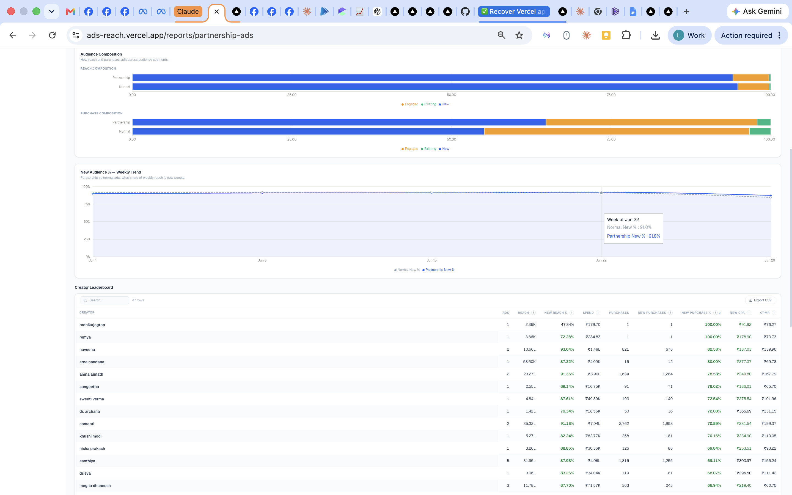

@AGENTS.md

# Ads Reach — Meta Advertising Intelligence Platform

Deployed at ads-reach.vercel.app. Shows merchants meaningful metrics beyond ROAS — things Ads Manager hides. Not anti-ROAS; surfaces what ROAS can't see.

GitHub: lovebhardwaj-commits/Audienceinsights (auto-deploys to Vercel on push to main).

## Stack

- **Next.js 16** (App Router) + React 19 + TypeScript 5
- **Tailwind CSS v4** (PostCSS plugin, inline `@theme` in globals.css)
- **Recharts 3** for all charts
- **iron-session** for encrypted cookie sessions (no database)
- **Meta Graph API v25.0** — all data comes from Meta's Ads Insights API

## Environment Variables

| Variable | Purpose |
|----------|---------|
| `META_APP_ID` | Facebook App ID |
| `META_APP_SECRET` | Facebook App Secret |
| `META_API_VERSION` | Graph API version (default `v25.0`) |
| `NEXTAUTH_URL` | Base URL for OAuth redirect |
| `SESSION_SECRET` | 32+ char string for iron-session encryption |

## Directory Layout

```
app/
  page.tsx                          # Login/landing (server component)
  layout.tsx                        # Root layout (Geist fonts)
  globals.css                       # Tailwind v4 theme, animations
  logs/page.tsx                     # Internal activity log — public route, outside (app)/'s auth guard
  (app)/
    layout.tsx                      # Auth guard → AccountProvider → DateRangeProvider → AppShell
    dashboard/page.tsx              # Report card grid
    reports/
      net-new-reach/page.tsx        # Expanding + sliding window reach
      campaign-overlap/page.tsx     # Entity overlap with NOT_IN queries
      conversion-windows/page.tsx   # 1d/7d/28d attribution comparison
      audience-segments/page.tsx    # user_segment_key breakdown
      frequency/page.tsx            # Campaign × week heatmap
      creative-churn/page.tsx       # Cohort spend over time
      creative-segments/page.tsx    # Per-entity segment split
      partnership-ads/page.tsx      # Creator vs normal ads
  api/
    auth/login/route.ts             # OAuth redirect to Meta
    auth/callback/route.ts          # Token exchange + session creation
    auth/logout/route.ts            # Session destroy
    accounts/route.ts               # List ad accounts
    reports/[type]/route.ts         # Dynamic report endpoint (maxDuration=120)

components/
  charts/                           # Recharts wrappers (all respect prefers-reduced-motion)
    ChartTooltip.tsx                 # Shared tooltip + axis formatters
    DualAxisChart.tsx                # Bars (left axis) + lines (right axis)
    HorizontalBar.tsx                # Horizontal stacked/grouped bars
    LineChart.tsx                    # Lines with optional bar overlay
    StackedBar.tsx                   # Stacked bar or area + optional Brush
    CohortAreaChart.tsx              # Stacked area with Brush (creative churn)
  layout/
    AppShell.tsx                     # Sidebar + TopBar + content
    Sidebar.tsx                      # Nav links (NAV_SLUGS array controls visibility)
    TopBar.tsx                       # Account selector + logout + token warning
    AccountSelector.tsx              # Ad account dropdown
    icons.tsx                        # SVG icons + REPORT_ICONS map
  providers/
    AccountProvider.tsx              # Fetches accounts, stores selectedAccountId in localStorage
    DateRangeProvider.tsx            # Global date range, defaults to lastNMonths(1)
  ui/                                # Shared UI primitives
    DataTable.tsx                    # Sortable, searchable, paginated table with CSV export
    DateRangePicker.tsx              # Month presets + custom range
    SummaryCard.tsx                  # KPI card with accent border + trend badge
    EmptyState.tsx, ErrorBanner.tsx, FetchingState.tsx
    HowToRead.tsx                    # Collapsible metric explainer
    InfoTooltip.tsx                  # Portal-rendered tooltip on hover/click
    ProgressIndicator.tsx            # Progress bar for streaming reports
    ReportSummary.tsx                # Auto-generated insight bullets

lib/
  meta-api.ts                       # Graph API client (retry, throttle, pagination)
  session.ts                        # iron-session config + requireSession()
  stream.ts                         # NDJSON streaming response wrapper
  constants.ts                      # API version, segment keys/labels/colors, REPORTS array
  chart-theme.ts                    # Color tokens (categorical, status, reach, overlap, spend)
  types.ts                          # SegmentKey, DateRange, InsightRow, MetaAdAccount, etc.
  format.ts                         # Currency-aware formatters (INR uses lakh/crore grouping)
  dates.ts                          # ISO date math, month/week windowing, lastNMonths/lastNDays
  calculations.ts                   # CPMR, CPP, overlap %, findAction, extractPurchases
  insights.ts                       # Auto-generated plain-text insights per report
  glossary.ts                       # 30+ metric definitions for InfoTooltips
  hooks/
    useJsonReport.ts                 # Fetch + parse JSON, holds previous data during refetch
    useStreamingReport.ts            # NDJSON stream consumer with progress + cancel
    useReducedMotion.ts              # prefers-reduced-motion media query hook
  reports/
    shared.ts                        # fetchCampaignList, fetchAccountTotals, fetchSingleBreakdown
    net-new-reach.ts                 # Sliding window: isolated vs baseline vs combined reach
    rolling-reach.ts                 # Expanding cumulative reach month-by-month
    campaign-overlap.ts              # Per-entity NOT_IN filtering (streaming, 1 query per entity)
    audience-segments.ts             # user_segment_key breakdown (weekly + overall)
    creative-segments.ts             # Per-entity segment split at campaign/adset/ad level
    conversion-windows.ts            # 1d/7d/28d click + 1d view attribution, time_increment=7
    frequency.ts                     # Campaign × week matrix (time_increment=7, limit=2000)
    creative-churn.ts                # Ad creation cohorts × weekly spend (time_increment=7)
    partnership-ads.ts               # Branded content detection, creator resolution, incremental reach
```

## Auth Flow

1. User clicks "Continue with Facebook" → `GET /api/auth/login` generates CSRF state, redirects to Meta OAuth
2. Meta redirects back → `GET /api/auth/callback` exchanges code for short-lived token, then long-lived token (60-day)
3. Token stored in iron-session cookie (`ads_reach_session`, 60-day maxAge)
4. `(app)/layout.tsx` server component calls `requireSession()` — redirects to `/` if no token
5. TopBar shows amber warning when token expires within 7 days

Scopes: `ads_read, pages_show_list, pages_read_engagement`

## Screenshots

### Dashboard

Report card grid with 5 active reports. Shows connected ad account, currency, and account ID.

### New Reach

Two modes: Expanding Window (cumulative) and Sliding Window (configurable lookback). KPI cards: Latest Window Reach, Total Spend, Latest Net New %, Avg Cost/1K Net New. DualAxisChart with stacked bars (net new vs reached previously) + % net new line. A second DualAxisChart below it ("Cost per 1K net new reach": spend bar + cost/1K line) passes `shareOfTotal={false}` — those two series don't share a unit, so a "% of total" tooltip reading would be meaningless. DataTable with monthly breakdown.

### Campaign Overlap

Level selector (Campaign/Adset/Ad), Top N input. KPI cards: Total Account Reach, Sum of All Reaches (with overlap gap %), Total Spend, Entity Count. HorizontalBar chart (blue = unique, orange = overlap) with % labels at bar ends. Sorted by total reach. DataTable with Unique % color-coded (green >60%, amber, red <10%).

### Conversion Windows

*(Screenshot predates the 1-day-view addition below — KPI row and chart have since changed.)*
KPI cards (6): Total Purchases (7DC+1DV), 28DC Purchases, 1DC Purchases, 1DV Purchases, Uplift Ratio, Cost Per Purchase. DualAxisChart with grouped (non-stacked) bars — Total/1DV/1DC/7DC/28DC purchase counts side-by-side per week, since they overlap conceptually rather than summing to a whole — plus Uplift Ratio as the only line; Spend isn't in the chart (too large a scale next to purchase counts), only the table. DataTable columns: Week, Spend, Total Purchases, 1DV Purchases, 1DC Purchases, 7DC Purchases, 28DC Purchases, Uplift Ratio, % Same-Day.

### User Segments

View level tabs: Account / Campaign / Adset / Ad. At account level: KPI cards (Total Reach, Spend, Purchases, New Audience %), StackedBar (spend by segment), LineChart (CPMR trend). At entity level: best/worst prospecting cards, HorizontalBar (100% stacked by segment), DataTable with New Reach % color coding.

### Partnership Ads


Head-to-head comparison cards (Partnership vs Normal). Sections: insight banner, incremental reach card, audience composition bars (reach + purchases), weekly trend chart (partnership vs normal new %), creator leaderboard table, expandable all-ads table.

## Reports

### Active (in sidebar + dashboard)

| Report | Slug | Data Source | Streaming |
|--------|------|-------------|-----------|
| New Reach | `net-new-reach` | Sliding/expanding window reach comparison | Yes (NDJSON) |
| Overlap | `campaign-overlap` | NOT_IN filtering per entity (streams bar-by-bar via `partial` events) | Yes (NDJSON) |
| Conversion Windows | `conversion-windows` | `action_attribution_windows: [1d_click, 7d_click, 28d_click, 1d_view]` | No |
| User Segments | `audience-segments` | `breakdowns=user_segment_key` | No |
| Partnership Ads | `partnership-ads` | `facebook_branded_content` / `instagram_branded_content` | No |
| Frequency | `frequency` | Campaign × week matrix (`time_increment=7`) | No |
| Creative Churn | `creative-churn` | Launch-cohort spend, always weekly | Yes (NDJSON) |

Frequency and Creative Churn are **active in nav** (7 reports total). Frequency was un-hidden in Phase 0 (7.6); Creative Churn was rescued in Phase 5 (7.7) and later hardened: it's always weekly (`time_increment=7`, no Daily toggle) NDJSON streaming, chunked into week-aligned windows (`weeklyAlignedWindows` in `lib/dates.ts`) fetched in parallel to stay under Vercel's 120s limit and avoid Meta silently truncating wide ranges. Every launch-month with spend gets its own cohort/color — no top-N cap, no "Other" bucket (a 12-month range shows 13 cohorts: 12 months + 1 "Pre-&lt;month&gt;" bucket for ads launched before the window). Defaults to a 1-month range (`useReportRange("creative-churn", 1)`). Its chart (`CohortAreaChart.tsx`) keys the `<AreaChart>` on the exact cohort-key sequence (`series.map(s=>s.key).join("|")`) — without it, widening the date range (growing the cohort set on an already-mounted chart) can leave React's keyed-list reconciliation pinning an existing `<Area>` at its old stack position instead of moving it, silently corrupting SVG paint order (no z-index escape hatch for SVG).

**Conversion Windows** was extended with **1-day view-through (`1d_view`)** attribution alongside the click windows. Two non-obvious Meta API facts, confirmed against Meta's own Insights API docs (don't re-derive or assume otherwise): (1) `1d_view` is real and currently supported — Meta permanently removed `7d_view`/`28d_view` in Jan 2026, but `1d_view` remains; (2) the unwindowed `actions[].value` field is **not** the ad account's actual configured attribution setting — whenever `action_attribution_windows` is explicitly specified in the request, `value` is pinned to `7d_click` regardless. So "Total Purchases" (`purchasesTotal` in `lib/reports/conversion-windows.ts`) is an explicit `purchases7dc + purchases1dv` sum approximating Meta's "7-day click or 1-day view" attribution preset — not a single combined action key (Meta doesn't expose one), and not additive-safe against double-counting a purchase that had both a qualifying view and a later click.

### Hidden (accessible via direct URL only)

| Report | Slug | Why Hidden |
|--------|------|------------|
| Creative Segments | `creative-segments` | Not in sidebar (drill-down target for User Segments) |

### Post-overhaul systems (added across Phases 0–5)

- **Error taxonomy** (`lib/meta-api.ts` `MetaErrorCode`): every failure is `META_AUTH | META_RATE_LIMIT | TIMEOUT | UNKNOWN`, carried through routes → `stream.ts` → hooks → `ErrorBanner`. Only Meta code 190 is auth; 504/timeout/AbortError → TIMEOUT with a "Retry with 1 month" action. 90s per-request server timeout + 110s client abort.
- **Findings engine** (`lib/findings.ts`): structured verdicts (`severity`, `headline`, `detail`, `action`, `moneyAtStake`) per report, ranked by money. Rendered by `components/ui/FindingsStrip.tsx` above each report chart and as the Overview findings feed.
- **Design tokens** (`globals.css`): warm `--surface-app #FAFAF8`, `--border-hairline`, ink scale, severity + metric-identity palettes exposed as Tailwind colors (`bg-surface-card`, `border-hairline`, `text-ink`, `bg-sev-*`). Cards are hairline + zero shadow; KPI values are Geist Mono; severity is the only source of card borders.
- **Label engine** (`lib/format.ts` `formatEntityLabels`): strips the common name prefix once, middle-ellipsizes the rest (D5). Used by Frequency + Overlap.
- **Chart system** (`components/charts/*`): axis titles with units, shared `ChartTooltipContent` (totals, share-of-total, partial tag), auto-brush > 12 points, reference lines, partial-period fade, auto-annotation (`lib/chart-annotations.ts`). `DualAxisChart` takes `shareOfTotal` (default `true` — turn off when bars/lines mix unrelated units, e.g. spend vs. a cost-per-unit line, where "% of total" is meaningless) and `stacked` (default `true` — turn off for grouped/side-by-side bars when series overlap conceptually instead of summing to a whole, e.g. Conversion Windows' Total/1DV/1DC/7DC/28DC purchase counts).
- **D-cache** (`lib/report-cache.ts`): client-side cache keyed by exact URL — **no TTL**, kept until the user picks a different range or storage fills up. Every report page's data-fetching `useEffect` calls `run(url)` directly with **no eviction** — `run()` (in `useJsonReport`/`useStreamingReport`) checks the cache itself and renders a hit instantly with no network call, so the last-generated report for the current account/range/params opens immediately on mount or when switching ranges. Only the explicit "Refresh" button evicts: `handleRefresh()` calls `evictCached(currentUrlRef.current)` then `run(currentUrlRef.current)` again, forcing a live re-fetch. (An earlier version of this pattern called `evictCached(url)` unconditionally inside the mount/range-change effect too — that defeated the cache entirely, since every page visit silently re-hit Meta. Fixed across all 8 report pages.) Known follow-up risk: because there's no TTL and eviction is now only ever explicit, a *response shape change* (adding a field to a report) can still serve an old cached object missing that field indefinitely for a previously-visited account/range, until the user hits Refresh — watch for `formatNumber(undefined)` rendering as literal "NaN" if you change a report's shape; there's no automatic cache-busting for that yet.
- **Per-report default range**: each report page owns its own default via `useReportRange(slug, defaultMonths)` (`lib/hooks/useReportRange.ts`), restored from an in-memory per-route map (`lib/session-ranges.ts` — survives SPA navigation, resets on a full page reload) or falling back to `lastNMonths(defaultMonths)`. Current defaults: **1 month for every report except New Reach, which defaults to 3.** (`MIN_USEFUL_MONTHS`/`DateRangeProvider.applyInitialMonths()` in `constants.ts`/`DateRangeProvider.tsx` are dead code — nothing calls them; don't use them as a source of truth.)
- **Demo mode**: `GET /api/auth/demo` sets `session.demo`; report/accounts routes serve `lib/demo-fixtures.ts` with no Meta token. Landing page has a "View live demo" link.
- **Activity log** (`lib/activity-log.ts`, page at `/logs`): internal-only, not shown to merchants — one entry per non-demo report fetch (account, report type, range, success/error, duration), so the team can see whether a given merchant is actually opening the app. Backed by a Google Sheet, not a database: `logReportEvent()` POSTs each entry to a Google Apps Script Web App URL (`ACTIVITY_LOG_WEBHOOK_URL`) that appends a row — see `docs/activity-log-setup.md` for the exact Apps Script code and deploy steps. Logging is fire-and-forget and never throws into the report response if the webhook isn't configured or the POST fails. `/logs` itself doesn't render a table — it just links out to the Sheet's own share URL (`ACTIVITY_LOG_SHEET_VIEW_URL`); sharing/access control is whatever the Sheet's own Google sharing settings say, not enforced by the app. `/logs` is listed in `middleware.ts`'s `PUBLIC_PATHS` — reachable with no login, separate from the merchant-facing password gate. JSON reports log via `next/server`'s `after()` (runs post-response, doesn't delay the client); streaming reports log via an `onSettled` callback passed into `ndjsonResponse()` (`lib/stream.ts`), since their response starts streaming before the work finishes. (An earlier version of this used Vercel KV — dropped because it required a paid plan; the Google Sheet approach is free and needs no infra on Vercel's side.)

## Meta API Patterns

- **Client**: `lib/meta-api.ts` — all requests go through `metaGet` / `metaInsights`
- **Retry**: Up to 3 retries with exponential backoff for error codes 4 (rate limit) and 17 (user request limit)
- **Throttle**: Reads `x-fb-ads-insights-throttle` header, pauses 2s when utilization > 75%
- **Pagination**: `metaGetAllPages` follows `paging.next` links
- **Auth errors**: Code 190 → `isAuthError = true` → UI shows re-authenticate prompt
- **Streaming**: Heavy reports use NDJSON via `ndjsonResponse()` — progress events, then a done/error event
- **time_increment=7**: Weekly granularity used everywhere, including creative churn (switched from daily to weekly to cut row volume ~7x and stay under Meta's rate limit)

## Design System

### Colors

Defined in `lib/chart-theme.ts`:
- **Categorical palette**: 8 colors for data series (blue, aqua, yellow, green, violet, red, magenta, orange)
- **Segment colors**: Prospecting=#2563EB, Engaged=#F59E0B, Existing=#10B981
- **Overlap**: Unique=#2563EB, Shared=#EA580C
- **Status**: Good=#0ca30c, Warning=#fab219, Serious=#ec835a, Critical=#d03b3b
- **Frequency heatmap**: 6-step ramp from light blue (healthy) through amber to dark red (overexposed)

Brand colors (Tailwind theme in globals.css): blue-50 through blue-900.

### Currency

`lib/format.ts` — module-level currency state set by `setCurrency(code)` when account changes. INR uses `en-IN` locale for lakh/crore grouping. Supports 30+ currencies.

### UI Conventions

- Every report page follows the same structure: header + DateRangePicker → HowToRead accordion → KPI SummaryCards → ReportSummary insights → chart → DataTable
- `SummaryCard` has left accent border color + icon
- `ReportSummary` has built-in `mt-4` spacing — no wrapper needed
- `ErrorBanner` interprets error strings (rate limit, auth, generic) and shows contextual hints
- `FetchingState` shows rotating messages while loading
- All charts gate `isAnimationActive` on `useReducedMotion()`
- `DataTable`: sticky first column, zebra striping, CSV export, search, pagination (50/page). Numeric columns use `width: 1%` + `nowrap` to shrink-to-fit; first column expands to fill. First column intercepts `onCopy` to write full (untruncated) name to clipboard.
- `HorizontalBar`: supports `percentOfTotal` prop to show % labels at bar ends (used in overlap chart)
- Frequency heatmap has actionable overexposure alerts: lists which campaigns are at 5×+, how many weeks, and concrete recommendations (frequency caps, audience broadening, creative rotation)

## Key Constraints

- **Default date range is 1 month for every report except New Reach (3 months)** — see `useReportRange` note above. Users can opt into longer ranges manually, up to 24 months back (`DateRangePicker.tsx` `MONTH_OPTIONS` — Meta's Insights API supports reach lookback well beyond a year, confirmed directly against the Graph API; this used to be capped at 13 on an incorrect assumption).
- **Date range persists per report for the session** (`lib/session-ranges.ts`, in-memory, survives SPA navigation, resets on full page reload) — not "always starts fresh."
- **`DateRangePicker`'s custom range never allows a future date** — both the native `<input>` `max` in the calendar's day-cell disabling and a defensive clamp in `applyCustom()`/day-click logic keep `until` capped at today. Nothing server-side validates this independently, so don't remove the client-side guard without adding one.
- **Campaign overlap is O(N)** in API calls — one `NOT_IN` query per entity, cannot be batched. Use topN to limit.
- **Creative churn fetches are chunked and parallelized** (`weeklyAlignedWindows` + `Promise.all` in `lib/reports/creative-churn.ts`) — a single wide-range Meta Insights request silently truncates to the most recent window, and sequential chunk fetching risks the Vercel 120s timeout. Still the heaviest report on very long ranges.
- **Partnership ad detection** relies on `facebook_branded_content.sponsor_page_id` or `instagram_branded_content` in ad creative fields. Creator name extraction uses a per-account user-configured prefix/suffix pattern (`components/CreatorPatternSetup.tsx`, saved to `localStorage` keyed `creator-pattern:{accountId}`) — there is no default/guessed pattern; until a user configures one, creators are unclassified ("Unknown").
- **Vercel maxDuration=120** on the reports API route.
- **No database** — all data is fetched live from Meta on each request.

## Common Tasks

### Adding a new report

1. Create `lib/reports/<name>.ts` with data-fetching function
2. Add case to `app/api/reports/[type]/route.ts` (streaming → `ndjsonResponse`, JSON → standard response)
3. Create `app/(app)/reports/<slug>/page.tsx` (use `useDateRange()`, `useJsonReport` or `useStreamingReport`)
4. Add to `REPORTS` array in `lib/constants.ts`
5. Add slug to `NAV_SLUGS` in `components/layout/Sidebar.tsx`
6. Add icon to `REPORT_ICONS` in `components/layout/icons.tsx`

### Hiding a report from nav + dashboard

Remove its slug from `NAV_SLUGS` in `Sidebar.tsx` AND from the `REPORTS` array in `lib/constants.ts`. The page remains accessible via direct URL.

### Changing default date range

Edit `DEFAULT_RANGE_MONTHS` (currently not a named constant — the value `1` is passed directly to `lastNMonths()` in `DateRangeProvider.tsx`).

## Dev Setup

```bash
cp .env.local.example .env.local   # fill in META_APP_ID, META_APP_SECRET, SESSION_SECRET
npm install
npm run dev                        # http://localhost:3000
```
